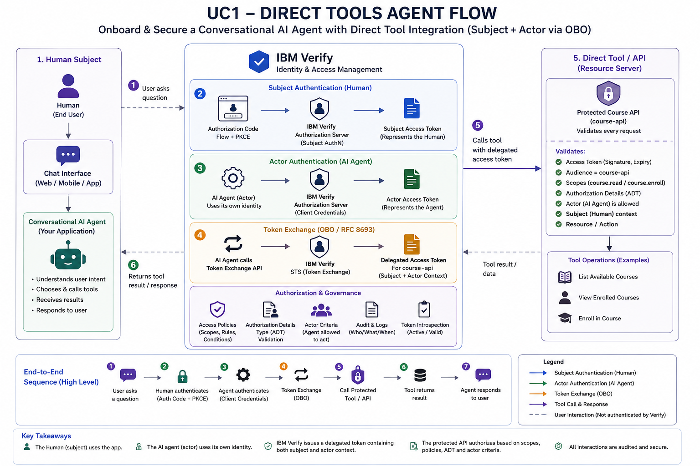
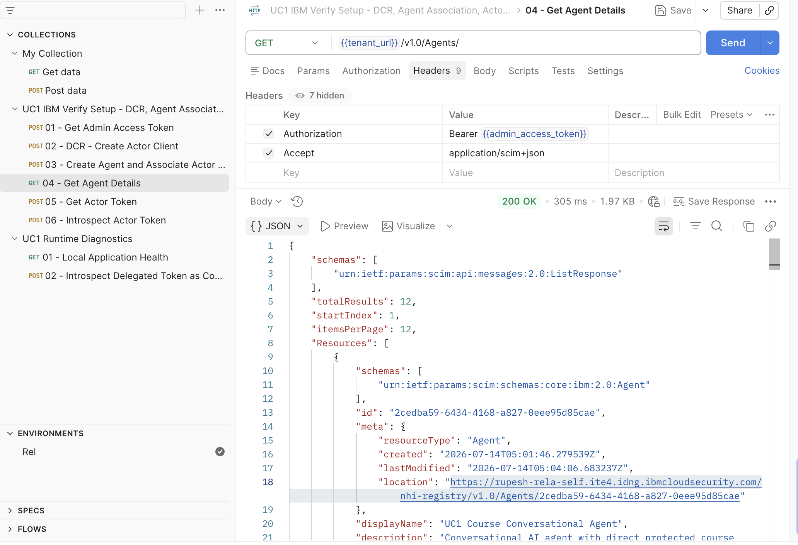
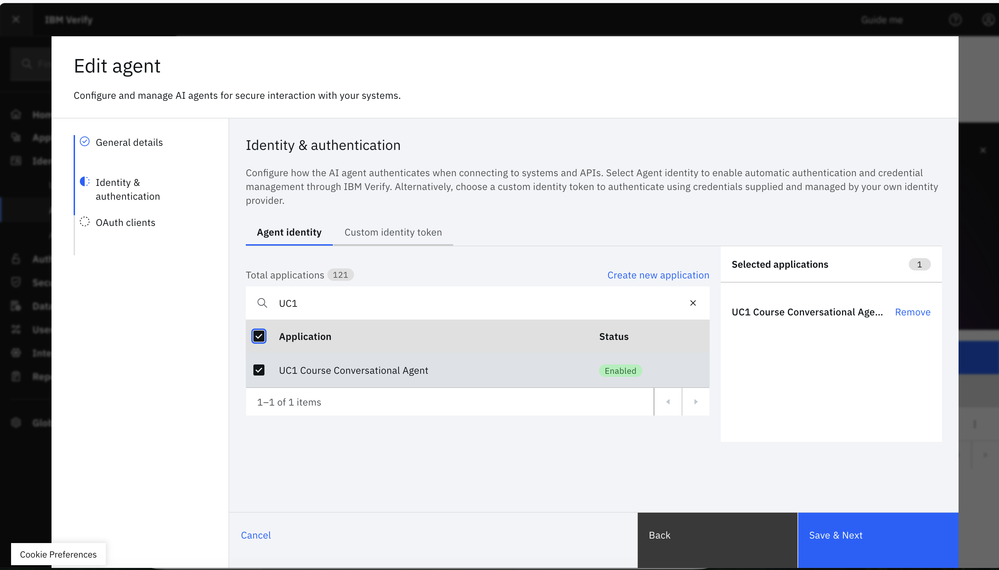
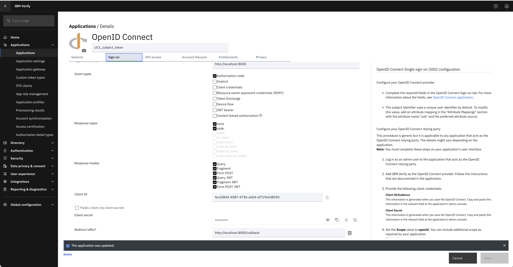

# Onboard & Secure a Conversational AI Agent with Direct Tool Integration

| ⚠️ EARLY ACCESS PREVIEW ⚠️ |
| :--- |
| Agent identity is under the Early Access Program (EAP) and for selected participants. Features and functionality are subject to change in the coming iterations. |

This sample demonstrates how to onboard a conversational AI agent as a governed **agent identity in IBM Verify** and secure agent interactions with business tools when the operation must run **on behalf of a signed-in human user**.

The example is a course assistant. A user signs in and asks natural-language questions such as:

```text
Show me the available courses.
Enroll me in Advanced Security Operations.
Show my enrolled courses.
```

The AI model selects the tool and requested operation, but that selection does not grant the agent authority to perform it. Before a protected course operation is executed, the application uses the user's subject token, obtains an actor token representing the agent, constructs the authorization details describing the requested operation, and requests a delegated access token from IBM Verify through OAuth 2.0 Token Exchange.

IBM Verify evaluates the delegation and authorization context before issuing the delegated token. The Course API then validates the delegated token and enforces the required audience, scope, actor and subject context, authorization details, and the sample's self-service policy before allowing the operation.




## Why this sample matters

Enterprise AI agents increasingly call APIs that read or change data on behalf of a person. A course agent may enroll a user, an HR agent may update employee information, or a finance agent may initiate a transaction. In these scenarios, identifying only the calling application is not sufficient.

The authorization decision needs to distinguish::

1. **Who is the human subject whose authority is being used?**
2. **Which AI agent is performing the action?**
3. **What has that agent been delegated authority to do?**

This sample keeps the **human identity**, **agent identity**, and **delegated authorization** distinct:

| **Concept** | **Represented as** | **Obtained by** |
|---|---|---|
| Human user | Subject | Authorization Code + PKCE |
| Conversational AI agent | Actor | Client Credentials |
| Delegated API authorization | Delegated access token | OAuth 2.0 Token Exchange |

The resulting API call carries both **subject context** and **actor context**, allowing IBM Verify and the target API to evaluate **who the agent is acting on behalf of** and **which agent is performing the action**, rather than treating the agent as anonymous middleware.

## What the sample demonstrates

- Register an OAuth client for the agent using Dynamic Client Registration (DCR).
- Onboard the course assistant in IBM Verify Agent Registry.
- Associate the agent identity with its OAuth client.
- Authenticate the human with Authorization Code + PKCE.
- Authenticate the agent with Client Credentials.
- Build operation-specific `authorization_details` for the tool selected by the AI agent.
- Exchange the subject and actor tokens at IBM Verify STS.
- Call a protected course tool/API with the delegated token.
- Validate audience, actor, scope, and authorization details at the resource boundary.
- Deny cross-user access in the sample even when the AI agent asks for it.

## Sample architecture

```text
+------------------+          +---------------------------+
| Human user       |          | IBM Verify                |
| browser / chat   |          |                           |
+--------+---------+          |  Subject client           |
         |                    |  Actor client + Agent     |
         | login              |  STS / Token Exchange     |
         +------------------->|  ADT / policy             |
         |                    +-------------+-------------+
         |                                  ^
         v                                  |
+--------+-------------------------------+  |
| Conversational Course Agent            |  |
|                                        |  |
|  llm_agent.py -> intent/action         |  |
|  rar_builder.py -> auth details        |  |
|  verify_oauth.py -> subject + actor ---+  |
|                     token exchange --------+
|  course_api.py -> protected tool/API       |
+-------------------------+------------------+
                          |
                          v
                 +--------+---------+
                 | Course API       |
                 | token validation |
                 | policy checks    |
                 +------------------+
```

### Runtime flow

1. The user opens the chat application.
2. The user selects **Login with IBM Verify**.
3. `verify_oauth.py` creates a PKCE verifier/challenge and redirects the browser to IBM Verify.
4. IBM Verify authenticates the human and returns an authorization code.
5. The application exchanges the code for the **subject access token**.
6. The user enters a natural-language request.
7. `llm_agent.py` classifies the request into one of the supported course actions.
8. The application resolves the requested target user.
9. `rar_builder.py` builds operation-specific authorization details.
10. The agent obtains its **actor access token** using Client Credentials.
11. The application sends the subject token, actor token, requested scope, audience, and authorization details to IBM Verify Token Exchange.
12. IBM Verify evaluates the exchange configuration and issues or denies a delegated token.
13. `course_api.py` receives the delegated token and validates the resource-side security conditions.
14. Only after validation passes does the course operation execute.
15. The diagnostic response shows the subject, actor, delegated-token claims, authorization details, and API decision for demonstration purposes.

## Project structure

```text
.
├── README.md                         # Main end-to-end tutorial
├── app.py                            # FastAPI routes and orchestration
├── config.py                         # Environment configuration
├── verify_oauth.py                   # PKCE, actor token, token exchange
├── llm_agent.py                      # Intent classification / fallback parser
├── rar_builder.py                    # Authorization Details builder
├── course_api.py                     # Protected course operations and validation
├── verify_directory.py               # Optional IBM Verify user lookup
├── token_utils.py                    # Demo token claim decoding helpers
├── templates/index.html              # Chat UI
├── mock_courses.json                 # Sample course data
├── payloads/                         # ADT and example authorization details
├── api-clients/postman/              # Postman setup and runtime collections
├── api-clients/insomnia/             # Insomnia setup and runtime collections
├── curl/                             # cURL setup and diagnostic examples
├── docs/                             # Code and customization supplements
└── images/                           # Screenshot / diagram placeholders
```

## Prerequisites

- Python 3.10 or later.
- An IBM Verify tenant with the OAuth/OIDC capabilities.
- Permission to create or manage dynamic OAuth clients.
- IBM Verify Agent Registry capability/API available in the target environment.
- Permission to create/register an agent and associate an OAuth client.
- Permission to configure an OIDC subject application, an STS/token-exchange client, scopes, audience, Authorization Details Type, and the required policy in the tenant.
- A Gemini API key only when `USE_LLM=true`. The sample can run with the deterministic parser by setting `USE_LLM=false`.

## Step 1 — Create an IBM Verify administrative API client

Create an IBM Verify API client with only the entitlements required to configure this sample.

The administrative API client is used by the setup scripts to:

- create the Agent Registry record; 
- authorize Dynamic Client Registration (DCR) when creating the agent's OAuth application.;


### Required entitlements

Configure the API client with the following entitlements:

| **Entitlement** | **API entitlement** | **Why it is required** |
|---|---|---|
| **Configure AI agents** | `writeAgents` | Required to create and update the Agent Registry record used by this sample. |
| **Manage OIDC client registration dynamically** | `manageOidcDynamicClient` | Required to create the agent OAuth client through Dynamic Client Registration when DCR requires bearer-token authentication. |

Do not select unrelated administrative entitlements. They are not required by this sample.

After creating the API client, record its client ID and client secret:

```bash
export VERIFY_ADMIN_CLIENT_ID="<admin-client-id>"
export VERIFY_ADMIN_CLIENT_SECRET="<admin-client-secret>"
```


Obtain the setup token:

```bash
curl --request POST "https://<tenant>/oauth2/token" \
  --header "Content-Type: application/x-www-form-urlencoded" \
  --data-urlencode "grant_type=client_credentials" \
  --data-urlencode "client_id=<admin-client-id>" \
  --data-urlencode "client_secret=<admin-client-secret>"
```

Save the returned `access_token` as `ADMIN_ACCESS_TOKEN`.

## Step 2 — Create the agent OAuth client using DCR

This sample uses Dynamic Client Registration (DCR) to create the OAuth application used by the agent at runtime.

The application is configured for the Client Credentials grant. The resulting client ID and client secret are used by the running agent to obtain its actor token.

Using cURL:

```bash
curl --request POST "https://<tenant>/oauth2/register" \
  --header "Authorization: Bearer <admin-access-token>" \
  --header "Content-Type: application/json" \
  --data @curl/payloads/actor-client-dcr.json
```
> Creating the client through DCR also creates an application that can be viewed and managed in the IBM Verify administration console.

The supplied DCR payload creates the OAuth application required by this sample with the Client Credentials grant and the agent.run scope.

Capture the returned:

```text
ACTOR_CLIENT_ID=<client_id>
ACTOR_CLIENT_SECRET=<client_secret>
```
These credentials belong to the agent's OAuth application and are used only to obtain the actor token at runtime.

## Verify the application in IBM Verify

After DCR completes:

1. Open the IBM Verify administration console.
2. Go to Applications.
3. Locate the application created by the DCR request.(For this sample use :UC1 Course Conversational Agent)
4. Open the application and verify that Client Credentials is enabled and that the expected agent.run scope is configured.
5. Set the access token format to JWT
6. Save the application after making the change.

The sample requires a JWT actor token because the token is subsequently supplied to IBM Verify as the actor_token during OAuth 2.0 Token Exchange.

### Postman

1. Import `api-clients/postman/uc1-ibm-verify-setup.postman_collection.json`.
2. Set `tenant_url`, `admin_client_id`, and `admin_client_secret`.
3. Run **01 - Get Admin Access Token**.
4. Run **02 - DCR - Create Actor Client**.
5. The collection stores `actor_client_id` and `actor_client_secret` from the response.

### Insomnia

1. Import `api-clients/insomnia/uc1-ibm-verify-setup.insomnia.json`.
2. Edit the base environment.
3. Run **01 Get Admin Access Token**.
4. Copy the access token to `admin_access_token`.
5. Run **02 DCR Create Actor Client**.
6. Copy the returned client ID and secret into the environment.

## Step 3 — Onboard the conversational agent and associate the actor client

The OAuth application created in Step 2 provides the runtime credentials used by the conversational agent to obtain an actor token.

The Agent Registry record represents the **governed identity of the AI agent** in IBM Verify. Keeping the Agent identity separate from the OAuth application allows the agent to be managed as an identity while its runtime credentials and application association are managed independently.

## Onboard the agent

Create a new Agent in IBM Verify with the following values:

Display name: UC1 Course Conversational Agent
Description: Conversational AI agent that invokes protected course tools
Tags: course-agent, direct-tools, conversational-ai

After creating the Agent, record the generated Agent ID.

Use below curl for Agent creation: 
```bash
export TENANT_URL="https://<tenant>"
export ADMIN_ACCESS_TOKEN="<admin-access-token>"
export ACTOR_CLIENT_ID="<actor-client-id>"


curl --request POST "$TENANT_URL/v1.0/Agents" \
  --header "Authorization: Bearer $ADMIN_ACCESS_TOKEN" \
  --header "Accept: application/scim+json" \
  --header "Content-Type: application/scim+json" \
  --data "$(envsubst < curl/payloads/course-agent.json)"
```

The sample payload uses:

```json
{
  
  "schemas": [
    "urn:ietf:params:scim:schemas:core:ibm:2.0:Agent"
  ],
  "displayName": "UC1 Course Conversational Agents",
  "description": "Conversational AI agent with direct protected course ssstools",
  "permissions": [],
  "tags": [
    "course-agent",
    "direct-tools",
    "conversational-ai"
  ]
}
```



## Associate the OAuth application

After the Agent has been created:

1. Open the Agent in the IBM Verify administration console.
2. Edit the Agent.
3. Go to Identity & authentication.
4. Select the OAuth application created in Step 2: UC1 Course Conversational Agent.
5. Continue through the configuration and save the Agent.
6. Reopen the Agent and verify that the OAuth application is shown under its identity and authentication configuration.




In Postman, continue the same setup collection:

6. Run **03 - Create Agent and Associate Actor Client**.
7. The response stores `agent_id` when the response includes `id`.
8. Run **04 - Get Agent Details** and verify `oauthClients` contains the actor client.

For more info on onboarding of Agents,please refer :https://www.ibm.com/docs/en/agent-identity?topic=tasks-onboarding-ai-agent

## Step 4 — Configure the human subject application

Create an OIDC application for the browser-facing chat application.

Required sample configuration:

| Setting | Sample value |
|---|---|
| Grant | Authorization Code |
| PKCE | Required / S256 |
| Redirect URI | `http://localhost:8000/callback` |
| Scopes | `openid profile email course.read course.enroll` |

Capture:

```text
SUBJECT_CLIENT_ID=<subject client ID>
SUBJECT_CLIENT_SECRET=<subject client secret, when required>
```
Note:Change Access token format to "JWT" from "Default". Under Introspect , register the actor client id with may_act attribute



## Step 5 — Create the Authorization Details Type

The Authorization Details Type (ADT) defines the structured authorization context that the agent sends during token exchange.

OAuth scopes such as course.read and course.enroll describe the general API permission being requested. The ADT adds the business-operation context needed by IBM Verify to evaluate the specific action the agent is attempting, for example:

which action is being requested;
which user is affected;
which agent initiated the request;
which target system and resource are involved; and
which course is being accessed.

This allows IBM Verify to make a more fine-grained authorization decision during token exchange instead of relying only on OAuth scopes.

To know more on Authorization Details Type visit :https://docs.verify.ibm.com/ibm-security-verify-access/docs/tasks-rar

The application builds an authorization detail with the type:

```text
urn:ibm:demo:verify:agent_action
```

The schema used by the sample is in:

```text
payloads/agent_action_adt_schema.json
```

A runtime request contains operation information similar to:

```json
[
  {
    "type": "urn:ibm:demo:verify:agent_action",
    "operationDetails": {
      "creator": "<actor-client-id>",
      "affectedPerson": "<target-subject>",
      "loggedInSubject": "<logged-in-subject>",
      "action": "enroll_course",
      "targetSystem": "course-api",
      "resource": "courses",
      "courseId": "SEC-301"
    }
  }
]
```

Register the schema and configure the IBM Verify criteria .


## Step 6 — Configure the STS / Token Exchange client

Create and IBM Verify application for token-exchange client for RFC 8693 token exchange.

The sample sends:

```text
grant_type          = urn:ietf:params:oauth:grant-type:token-exchange
subject_token        = human access token
subject_token_type   = urn:ietf:params:oauth:token-type:access_token
actor_token          = agent access token
actor_token_type     = urn:ietf:params:oauth:token-type:access_token
scope                 = course.read course.enroll
audience              = course-api
authorization_details = urn:ibm:demo:verify:agent_action
```

Configure the IBM Verify application to accept the subject and actor token types used by this sample and to issue the requested access-token type. Restrict allowed authorization detail types and apply the access policy/actor criteria appropriate for your environment.

Capture:

```text
STS_CLIENT_ID=<STS client ID>
STS_CLIENT_SECRET=<STS client secret>
```
Note:Change Access token format to "JWT" from "Default"

> Note : The client ID of the Token Exchange application needs to placed as STS_CLIENT_ID and respective SECRET

## Step 7 — Configure the application

Copy the sample environment file:

```bash
cp .env.example .env
```

Populate:

```dotenv
APP_BASE_URL=http://localhost:8000
SESSION_SECRET=<random-local-session-secret>

USE_LLM=false
GEMINI_API_KEY=
GEMINI_MODEL=gemini-2.5-flash

VERIFY_ISSUER=https://<tenant>/oauth2
VERIFY_AUTHORIZATION_ENDPOINT=https://<tenant>/oauth2/authorize
VERIFY_TOKEN_ENDPOINT=https://<tenant>/oauth2/token
VERIFY_JWKS_URI=https://<tenant>/oauth2/jwks
VERIFY_INTROSPECTION_ENDPOINT=https://<tenant>/oauth2/introspect

SUBJECT_CLIENT_ID=<subject-client-id>
SUBJECT_CLIENT_SECRET=<subject-client-secret>
SUBJECT_REDIRECT_URI=http://localhost:8000/callback
SUBJECT_SCOPES=openid profile email course.read course.enroll

ACTOR_CLIENT_ID=<actor-client-id-created-by-dcr>
ACTOR_CLIENT_SECRET=<actor-client-secret-created-by-dcr>
ACTOR_SCOPES=agent.run

STS_CLIENT_ID=<sts-client-id>
STS_CLIENT_SECRET=<sts-client-secret>
STS_REQUESTED_SCOPE=course.read course.enroll

AGENT_ADT_TYPE=urn:ibm:demo:verify:agent_action
COURSE_API_AUDIENCE=course-api
```


For the first successful run, use:

```dotenv
USE_LLM=false
```

After the OAuth flow is working, enable Gemini:

```dotenv
USE_LLM=true
GEMINI_API_KEY=<your-key>
```

## Step 8 — Install and run

macOS/Linux:

```bash
python3 -m venv .venv
source .venv/bin/activate
pip install -r requirements.txt
pip install pyJWT jinja2


```bash
uvicorn app:app --reload --host 0.0.0.0 --port 8000
```

Open:

```text
http://localhost:8000
```

Check health:

```bash
curl http://localhost:8000/health
```

Expected:

```json
{"status":"ok"}
```

## Step 9 — Run the demo

### Test A — List available courses

Prompt:

```text
Show me the available courses.
```

Expected action:

```text
list_available_courses
```

Expected security result:

- user subject is present;
- agent actor token is obtained;
- authorization details target `course-api`;
- delegated token includes the required read authority;
- Course API permits the operation.

### Test B — Enroll the signed-in user

Prompt:

```text
Enroll me in Advanced Security Operations.
```

The deterministic parser maps this sample request to course `SEC-301`.

Expected action:

```text
enroll_course
```

Expected security result:

- `affectedPerson` represents the signed-in user;
- `loggedInSubject` represents the signed-in user;
- actor identity represents the registered agent client;
- requested scope includes `course.enroll`;
- Course API permits the operation when all validation succeeds.

### Test C — List the user's enrolled courses

Prompt:

```text
Show my enrolled courses.
```

Expected action:

```text
list_enrolled_courses
```

### Test D — Attempt cross-user access

Prompt:

```text
Show Rick's enrolled courses.
```

Expected result:

```text
DENIED
```

The demo's protected API policy checks that the requested subject matches the logged-in subject. This is deliberately implemented at the protected-resource boundary; the LLM is not trusted as the authorization decision point.

## What to look for in the logs

The sample prints a diagnostic token-exchange request with secrets and most token content masked/truncated. Look for:

```text
===== TOKEN EXCHANGE REQUEST =====
```

Verify:

```text
subject_token       -> human token
actor_token         -> agent token
audience            -> course-api
authorization_details.operationDetails.creator -> actor client ID
authorization_details.operationDetails.action  -> selected course action
```

Then inspect the JSON returned by `/chat` in the browser developer tools or HTTP client. The `diagnostic` object includes:

```text
subject_claims
actor_token_claims
delegated_token_claims
authorization_details
api_result.validation
```

These diagnostics exist for the tutorial. Do not expose raw token claims or authorization internals to untrusted users in a production UI.

## Verify the delegated token using introspection

Use the **resource client**:

```bash
curl --request POST "https://<tenant>/oauth2/introspect" \
  --user "<resource-client-id>:<resource-client-secret>" \
  --header "Content-Type: application/x-www-form-urlencoded" \
  --data-urlencode "token=<delegated-access-token>"
```

Or import `api-clients/postman/uc1-runtime-diagnostics.postman_collection.json` and run **Introspect Delegated Token as Course API Resource**.

Expected minimum result:

```json
{
  "active": true
}
```

Also inspect the audience, scopes, actor representation, and authorization details returned by your IBM Verify configuration.


## Direct tools and function invocation

This sample uses **direct Python function integration**. There is no MCP server between the conversational agent and the Course API.

The AI model does not call an arbitrary Python function by name. `llm_agent.py` first converts the user's natural-language request into one of three allow-listed actions. The `/chat` handler then passes that action to the protected Course API adapter.

### Tools exposed by this sample

| User intent | Agent action | Required scope | Protected operation |
| --- | --- | --- | --- |
| "What courses are available?" | `list_available_courses` | `course.read` | Return the available course catalog |
| "Show my enrolled courses" | `list_enrolled_courses` | `course.read` | Return courses for the authenticated subject |
| "Enroll me in advanced security training" | `enroll_course` | `course.enroll` | Enroll the authenticated subject in the selected course |

These are the only actions accepted by the agent:

```python
ALLOWED_ACTIONS = {
    "list_available_courses",
    "enroll_course",
    "list_enrolled_courses",
}
```

### Where is the tool selected?

The selection happens in `llm_agent.py`.

```python
decision = decide_action(message)
```

`decide_action()` asks the configured model to classify the request and return structured JSON similar to:

```json
{
  "action": "enroll_course",
  "course_id": "SEC-301",
  "target_subject": "self",
  "reason": "User asked to enroll in advanced security training."
}
```

For example:

```text
User:
Please enroll me into advanced security training

        |
        v

llm_agent.py
decide_action(message)

        |
        v

AgentDecision(
    action="enroll_course",
    course_id="SEC-301",
    target_subject="self"
)
```

The model can select only an action present in `ALLOWED_ACTIONS`. The application rejects unsupported action values.

> The LLM selects intent. The LLM does not grant access and does not issue the OAuth token.

### Which function is called after tool selection?

The `/chat` handler in `app.py` is the agent orchestrator.

After `decide_action()` returns, `app.py` performs the identity and authorization flow and finally calls:

```python
api_result = call_course_api(
    delegated_token=delegated_token,
    action=action,
    requested_subject=target_subject,
    logged_in_subject=logged_in_subject,
)
```

`call_course_api()` is implemented in `course_api.py`.

The action passed to this function determines the protected course operation:

```python
if action == "list_available_courses":
    # Return AVAILABLE_COURSES

if action == "list_enrolled_courses":
    # Return courses for the logged-in subject

if action == "enroll_course":
    # Read courseId from authorization_details
    # Validate the course
    # Enroll the logged-in subject
```

Therefore, the direct-tool mapping is:

```text
list_available_courses
        |
        +--> call_course_api(... action="list_available_courses")
                  |
                  +--> return AVAILABLE_COURSES


list_enrolled_courses
        |
        +--> call_course_api(... action="list_enrolled_courses")
                  |
                  +--> ENROLLED_COURSES[logged_in_subject]


enroll_course
        |
        +--> call_course_api(... action="enroll_course")
                  |
                  +--> read courseId from authorization_details
                  |
                  +--> validate course
                  |
                  +--> add course to ENROLLED_COURSES[logged_in_subject]
```

### Complete function call flow

For the prompt:

```text
Please enroll me into advanced security training
```

the actual application flow is:

```text
app.py
chat()
  |
  +--> llm_agent.py
  |      decide_action(message)
  |         |
  |         +--> AgentDecision(
  |                 action="enroll_course",
  |                 course_id="SEC-301",
  |                 target_subject="self"
  |              )
  |
  +--> app.py
  |      resolve_target_subject(...)
  |
  +--> rar_builder.py
  |      build_agent_authorization_details(
  |          action="enroll_course",
  |          course_id="SEC-301",
  |          affected_person=<subject>
  |      )
  |
  +--> verify_oauth.py
  |      get_actor_token()
  |         |
  |         +--> IBM Verify /oauth2/token
  |              grant_type=client_credentials
  |
  +--> verify_oauth.py
  |      token_exchange(
  |          subject_token,
  |          actor_token,
  |          authorization_details
  |      )
  |         |
  |         +--> IBM Verify STS
  |              OAuth 2.0 Token Exchange
  |
  +--> course_api.py
         call_course_api(
             delegated_token,
             action="enroll_course",
             requested_subject=<subject>,
             logged_in_subject=<subject>
         )
            |
            +--> _validate_scope()
            +--> _validate_audience()
            +--> _validate_actor()
            +--> _validate_authorization_details()
            |
            +--> execute enroll_course operation
            |
            +--> return result
  |
  +--> app.py
         build_answer(api_result)
  |
  +--> Human receives response
```

### Why the tool function obtains authorization before execution

A direct tool call is **not** executed immediately after the LLM selects the action.

The sequence is deliberately:

```text
LLM selects action
        |
        v
Build operation context
        |
        v
Obtain agent actor token
        |
        v
Exchange subject + actor context at IBM Verify
        |
        v
Receive delegated token
        |
        v
Call protected tool
        |
        v
Tool validates delegated authorization
        |
        v
Execute operation
```

This is the security value of the sample.

Without IBM Verify, an implementation could effectively become:

```text
LLM says "enroll"
        |
        v
Python function enrolls user
```

In this sample, the flow is:

```text
LLM says "enroll"
        |
        v
Application identifies requested operation
        |
        v
IBM Verify evaluates subject + actor + requested authorization details
        |
        v
Protected Course API validates the delegated token
        |
        v
Only then is the enrollment operation executed
```

### Direct tool implementation versus a framework FunctionTool

Some agent frameworks explicitly register a Python method as a `FunctionTool`.

This sample keeps the implementation framework-neutral. The equivalent conceptual registration is:

```python
TOOLS = {
    "list_available_courses": call_course_api,
    "list_enrolled_courses": call_course_api,
    "enroll_course": call_course_api,
}
```

The current code centralizes the protected operations in `call_course_api()` so that every action passes through the same token and authorization validation boundary.

If you replace the intent classifier with AutoGen, LangGraph, CrewAI, or another agent framework, keep the IBM Verify security sequence around each protected tool invocation:

```text
Framework tool selected
        |
        v
Build authorization_details
        |
        v
Get actor token
        |
        v
Token exchange with subject + actor
        |
        v
Invoke protected tool with delegated token
```

For a source-level walkthrough, see `docs/direct-tools-function-flow.md`.


## How the code works

### `app.py` — orchestration

`/login` starts the subject login flow. `/callback` stores the subject tokens in the signed session. `/chat` performs the agentic flow:

```text
message
  -> decide_action()
  -> resolve target subject
  -> build authorization details
  -> get_actor_token()
  -> token_exchange(subject, actor, authorization_details)
  -> call_course_api(delegated_token, action, subject)
```

### `llm_agent.py` — AI decision

The classifier returns only supported actions. The application still checks the action against `ALLOWED_ACTIONS`.

The model selects **what the user appears to want**. It does not decide whether the request is authorized.

### `rar_builder.py` — operation context

This module creates the `authorization_details` sent to IBM Verify. It binds the requested action to contextual fields such as the creator/actor, affected person, logged-in subject, target system, resource, and course ID.

### `verify_oauth.py` — identity and token flow

This module implements:

- PKCE generation;
- authorization URL construction;
- authorization-code exchange for the subject token;
- client-credentials token request for the actor token;
- RFC 8693 token exchange.

### `course_api.py` — protected resource boundary

The sample Course API validates the delegated token claims before executing the operation. It checks:

- expected audience;
- actor/client relationship expected by the sample;
- matching authorization details;
- required scope for the action;
- self-service subject policy.

This is the critical security boundary. The API does not trust the prompt or LLM result by itself.

## Using Postman and Insomnia

### Setup collection

Use:

```text
api-clients/postman/uc1-ibm-verify-setup.postman_collection.json
api-clients/insomnia/uc1-ibm-verify-setup.insomnia.json
```

The setup collection is ordered:

```text
01 Get Admin Access Token
02 DCR Create Actor Client
03 Create Agent and Associate Actor Client
04 Get Agent Details
05 Get Actor Token
06 Introspect Actor Token
```

### Runtime diagnostics collection

Use:

```text
api-clients/postman/uc1-runtime-diagnostics.postman_collection.json
api-clients/insomnia/uc1-runtime-diagnostics.insomnia.json
```

The normal subject login and token exchange are intentionally performed by the application because the PKCE verifier, browser session, OAuth state, user interaction, action, and authorization details are created dynamically at runtime.

## Security controls demonstrated

| Control | Enforcement point |
|---|---|
| Human authentication | IBM Verify authorization flow |
| Agent authentication | IBM Verify token endpoint |
| Agent/client association | IBM Verify Agent Registry metadata |
| Delegated token issuance | IBM Verify STS / token exchange |
| Operation context | Authorization Details Type |
| API audience | Course API token validation |
| Required scope | Course API validation |
| Cross-user denial | Course API sample policy |
| AI action allow-list | Application orchestration |

## Production considerations

This repository is a demonstration. Before production use:

- store secrets in a managed secret store;
- use an appropriate confidential/public client model for the deployed frontend architecture;
- validate JWT signatures using the issuer JWKS or use introspection rather than unverified decoding;
- do not return token claims to the browser as diagnostics;
- implement durable token/session storage;
- use TLS for all deployed endpoints;
- define least-privilege scopes per tool;
- configure IBM Verify policy and actor criteria for your actual trust model;
- use a real Course API and enforce authorization at that resource;
- audit agent identity, subject identity, requested operation, and authorization result.

## Troubleshooting

### `invalid authorization details`

Check that `AGENT_ADT_TYPE` exactly matches the type registered in IBM Verify and that the emitted JSON conforms to the configured schema.

### Token exchange succeeds but Course API returns 403 audience error

Check:

```dotenv
COURSE_API_AUDIENCE=course-api
```

and verify the STS request/configuration issues the delegated token for the same audience.

### Actor token fails

Confirm the DCR-created client allows Client Credentials and the requested actor scope is permitted:

```dotenv
ACTOR_SCOPES=agent.run
```

### Login callback fails

The IBM Verify subject application's redirect URI and `SUBJECT_REDIRECT_URI` must match exactly:

```text
http://localhost:8000/callback
```

### Introspection fails with invalid client

Use the Course API resource client credentials. Do not use the STS client credentials unless that client is explicitly the protected resource—which is not the architecture documented by this sample.

### Other-user prompt does not resolve a user

Configure the optional Verify Directory management client. The self-service tests do not require it.


## IBM Verify documentation references

- [Create a dynamic client](https://docs.verify.ibm.com/verify/reference/post_oauth2-register)
- [Get an access token](https://docs.verify.ibm.com/verify/reference/post_oauth2-token)
- [Authorization Code grant](https://docs.verify.ibm.com/verify/docs/oauth-20-grant-type-authorization-code)
- [OAuth 2.0 Token Exchange](https://docs.verify.ibm.com/verify/docs/oauth-20-token-exchange)
- [Introspect a token](https://docs.verify.ibm.com/verify/reference/post_oauth2-introspect)
- [Create an API client](https://docs.verify.ibm.com/verify/docs/support-developers-create-api-client)

> The Agent Registry API used by this sample is also supplied in the API collections from the source package. If the Agent Registry capability or API is not enabled in your tenant/release, use the IBM Verify Agent Registry UI available in your environment and capture the values requested by this guide.
