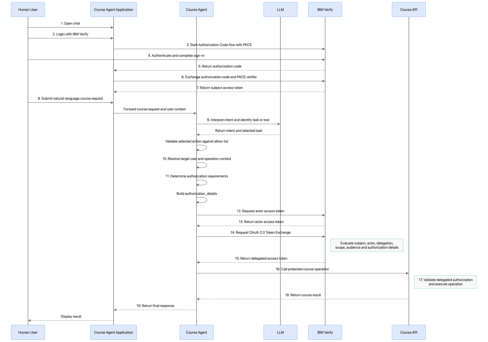
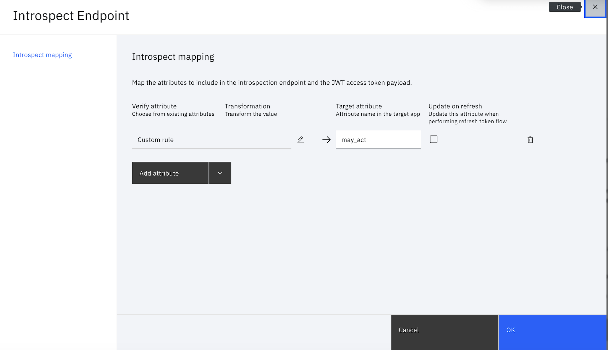

# Onboard & Secure a Conversational AI Agent with Direct Tool Integration

| ⚠️ EARLY ACCESS PREVIEW ⚠️ |
| :--- |
| Agent identity is under the Early Access Program (EAP) and for selected participants. Features and functionality are subject to change in the coming iterations. |

This sample demonstrates how to onboard a conversational AI agent as a governed **agent identity in IBM Verify** and secure agent interactions with business tools when the operation must run **on behalf of a signed-in human user**.

The example is a course assistant. A user signs in and asks natural-language questions such as:

```text
Show me the available courses.
Enroll me in Advanced Security Operations.
Show my enrolled courses.
```

The AI model selects the tool and requested operation, but that selection does not grant the agent authority to perform it. Before a protected course operation is executed, the application uses the user's subject token, obtains an actor token representing the agent, constructs the authorization details describing the requested operation, and requests a delegated access token from IBM Verify through OAuth 2.0 Token Exchange.

IBM Verify evaluates the delegation and authorization context before issuing the delegated token. The Course API then validates the delegated token and enforces the required audience, scope, actor and subject context, authorization details, and the sample's self-service policy before allowing the operation.


## Why this sample matters

Enterprise AI agents increasingly call APIs that read or change data on behalf of a person. A course agent may enroll a user, an HR agent may update employee information, or a finance agent may initiate a transaction. In these scenarios, identifying only the calling application is not sufficient.

The authorization decision needs to distinguish:

1. **Who is the human subject whose authority is being used?**
2. **Which AI agent is performing the action?**
3. **What has that agent been delegated authority to do?**

This sample keeps the **human identity**, **agent identity**, and **delegated authorization** distinct:

| **Concept** | **Represented as** | **Obtained by** |
|---|---|---|
| Human user | Subject | Authorization Code + PKCE |
| AI agent | Registered Agent identity associated with its OAuth application | Actor token obtained using Client Credentials |
| Delegated API authorization | Delegated access token | OAuth 2.0 Token Exchange |

The resulting API call carries both **subject context** and **actor context**, allowing IBM Verify and the target API to evaluate **who the agent is acting on behalf of** and **which agent is performing the action**, rather than treating the agent as anonymous middleware.

## What the sample demonstrates

- Register an OAuth client for the agent using Dynamic Client Registration (DCR).
- Onboard the course assistant in IBM Verify Agent Registry.
- Associate the agent identity with its OAuth client.
- Authenticate the human with Authorization Code + PKCE.
- Authenticate the agent with Client Credentials.
- Build operation-specific `authorization_details` for the tool selected by the AI agent.
- Exchange the subject and actor tokens at IBM Verify STS.
- Call a protected course tool/API with the delegated token.
- Validate audience, actor, scope, and authorization details at the resource boundary.
- Deny cross-user access in the sample even when the AI agent asks for it.

## Sample architecture

The sample has four logical runtime entities:

- **Human User** — the person interacting with the course assistant.
- **Course Agent Application** — the running application that interprets the user's request and orchestrates the OAuth and token-exchange flows.
- **IBM Verify** — authenticates the human and agent, evaluates the delegation context, and issues the delegated access token.
- **Course API** — the protected resource that validates the delegated authorization before executing a course operation.

IBM Verify also contains the configuration objects used by the flow, including the human subject application, Agent identity, Agent OAuth application, Token Exchange application, and Authorization Details Type.

```text
+--------------------+          +----------------------------------+
| Human User         |          | IBM Verify                       |
| browser / chat     |          |                                  |
+---------+----------+          |  Subject OIDC Application        |
          |                     |                                  |
          |                     |  Agent Identity / Agent Registry |
          |                     |          +                       |
          |                     |  Agent OAuth Application         |
          |                     |                                  |
          |                     |  STS / Token Exchange Application|
          |                     |                                  |
          |                     |  Authorization Details Type      |
          |                     |  and authorization policy        |
          |                     +----------------+-----------------+
          |                                      ^
          v                                      |
+---------+--------------------------------------+---+
| Course Agent Application                          |
|                                                   |
|  app.py          -> runtime orchestration          |
|  llm_agent.py    -> intent / action selection      |
|  rar_builder.py  -> authorization details          |
|  verify_oauth.py -> subject, actor and token       |
|                     exchange flows                 |
+--------------------------+------------------------+
                           |
                           | delegated access token
                           v
                  +--------+---------+
                  | Course API       |
                  |                  |
                  | token validation |
                  | authorization    |
                  | course operation |
                  +------------------+
```

The **Course Agent Application** is the runtime component that performs the OAuth protocol operations. The **Agent Identity** in IBM Verify is the governed identity of the AI agent; it does not itself execute code. The **Agent OAuth Application** provides the credentials that the Course Agent Application uses to obtain the actor token.

The runtime sequence below uses these same entity names consistently.
The following sequence shows which logical entity performs each operation. The step numbers correspond directly to the **Runtime flow** described below.

## Flow Diagram
 
 


### Runtime flow

The numbered steps below correspond directly to the **Runtime sequence** diagram above.

1. The **Human User** opens the **Course Agent Application**.

2. The **Human User** selects **Login with IBM Verify**.

3. The **Course Agent Application** starts the Authorization Code flow with PKCE and redirects the browser to **IBM Verify**.

4. The **Human User** authenticates with **IBM Verify** and completes the sign-in process.

5. **IBM Verify** redirects the browser back to the **Course Agent Application** with an authorization code.

6. The **Course Agent Application** exchanges the authorization code and PKCE verifier with **IBM Verify**.

7. **IBM Verify** returns the human user's **subject access token** to the **Course Agent Application**.

8. The **Human User** submits a natural-language course request to the **Course Agent Application**.

9. The **Course Agent Application** maps the request to one of the allow-listed course actions.

10. The **Course Agent Application** resolves the target user and other context required for the requested operation.

11. The **Course Agent Application** constructs the operation-specific `authorization_details` that describe what the agent is requesting to do.

12. The **Course Agent Application** requests an **actor access token** from **IBM Verify** using the credentials of the Agent OAuth application associated with the registered Agent identity.

13. **IBM Verify** authenticates the Agent OAuth application and returns the **actor access token** to the **Course Agent Application**.

14. The **Course Agent Application** sends an OAuth 2.0 Token Exchange request to **IBM Verify** containing the subject token, actor token, requested scope, audience, and `authorization_details`.

15. **IBM Verify** evaluates the subject, actor, delegation relationship, requested authorization context, and Token Exchange configuration. If the request is allowed, IBM Verify returns a **delegated access token**.

16. The **Course Agent Application** calls the protected **Course API** using the delegated access token.

17. The **Course API** validates the delegated authorization, including the expected audience, required scope, actor and subject context, and authorization details. If validation succeeds, the Course API executes the requested course operation.

18. The **Course API** returns the result to the **Course Agent Application**.

19. The **Course Agent Application** presents the result to the **Human User**.


## Project structure

```text
.
├── README.md                         # Main end-to-end tutorial
├── app.py                            # FastAPI routes and orchestration
├── config.py                         # Environment configuration
├── verify_oauth.py                   # PKCE, actor token, token exchange
├── llm_agent.py                      # Intent classification / fallback parser
├── rar_builder.py                    # Authorization Details builder
├── course_api.py                     # Protected course operations and validation
├── verify_directory.py               # Optional IBM Verify user lookup
├── token_utils.py                    # Demo token claim decoding helpers
├── templates/index.html              # Chat UI
├── mock_courses.json                 # Sample course data
├── payloads/                         # ADT and example authorization details
├── api-clients/postman/              # Postman setup and runtime collections
├── api-clients/insomnia/             # Insomnia setup and runtime collections
├── curl/                             # cURL setup and diagnostic examples
├── docs/                             # Code and customization supplements
└── images/                           # Screenshot / diagram placeholders
```

## Prerequisites

- Python 3.10 or later.
- An IBM Verify tenant with the OAuth/OIDC capabilities.
- Permission to create or manage dynamic OAuth clients.
- IBM Verify Agent Registry capability/API available in the target environment.
- Permission to create/register an agent and associate an OAuth client.
- Permission to configure an OIDC subject application, an STS/token-exchange client, scopes, audience, Authorization Details Type, and the required policy in the tenant.
- A Gemini API key only when `USE_LLM=true`. The sample can run with the deterministic parser by setting `USE_LLM=false`.

## Step 1 — Create an IBM Verify administrative API client

Create an IBM Verify API client with only the entitlements required to configure this sample.

The administrative API client is used by the setup scripts to:

- create the Agent Registry record; 
- authorize Dynamic Client Registration (DCR) when creating the agent's OAuth application.


### Required entitlements

Configure the API client with the following entitlements:

| **Entitlement** | **API entitlement** | **Why it is required** |
|---|---|---|
| **Configure AI agents** | `writeAgents` | Required to create and update the Agent Registry record used by this sample. |
| **Manage AI agents** | `manageAgentStatus`| Review and manage AI agent status |
| **Manage OIDC client registration dynamically** | `manageOidcDynamicClient` | Required to create the agent OAuth client through Dynamic Client Registration when DCR requires bearer-token authentication. |
| **Manage authorization detail types** | `manageAuthDetailTypes` | Create and manage the Authorization Details Type used by this sample. |

Do not select unrelated administrative entitlements. They are not required by this sample.

After creating the API client, record its client ID and client secret:

```bash
export TENANT="https://<your-tenant>"
export VERIFY_ADMIN_CLIENT_ID="<admin-client-id>"
export VERIFY_ADMIN_CLIENT_SECRET="<admin-client-secret>"
```

Obtain an administrative access token:

```bash
curl --request POST "$TENANT/oauth2/token" \
  --header "Content-Type: application/x-www-form-urlencoded" \
  --data-urlencode "grant_type=client_credentials" \
  --data-urlencode "client_id=$VERIFY_ADMIN_CLIENT_ID" \
  --data-urlencode "client_secret=$VERIFY_ADMIN_CLIENT_SECRET"
```

Copy the `access_token` value from the response and set:

```bash
export ADMIN_ACCESS_TOKEN="<access-token>"
```

## Step 2 — Create the Agent OAuth application

The Course Agent Application needs OAuth credentials that it can use at runtime to obtain an actor access token from IBM Verify.

This tutorial uses **Dynamic Client Registration (DCR)** to create that OAuth application. DCR is the registration method chosen for this tutorial; it is **not a requirement of the Agentic Identity or token-exchange flow**. The same OAuth application can also be created manually through **Applications** in the IBM Verify administration console and configured with the Client Credentials grant.

For this tutorial, create the application through DCR using **one** of the following methods:

- cURL
- Postman
- Insomnia


### Using cURL

```bash
curl --request POST "$TENANT/oauth2/register" \
  --header "Authorization: Bearer $ADMIN_ACCESS_TOKEN" \
  --header "Content-Type: application/json" \
  --data @curl/payloads/actor-client-dcr.json
```

### Postman

* Import `api-clients/postman/uc1-ibm-verify-setup.postman_collection.json`.<br>
* Set `TENANT`, `VERIFY_ADMIN_CLIENT_ID`, and `VERIFY_ADMIN_CLIENT_ID`.<br>
* Run **01 - Get Admin Access Token**.<br>
* Copy the access token to `ADMIN_ACCESS_TOKEN`.<br>
* Run **02 - DCR - Create Actor Client**.<br>


### Insomnia

* Import `api-clients/insomnia/uc1-ibm-verify-setup.insomnia.json`.<br>
* Set `TENANT`, `VERIFY_ADMIN_CLIENT_ID`, and `VERIFY_ADMIN_CLIENT_ID`.<br>
* Edit the base environment.<br>
* Run **01 Get Admin Access Token**.<br>
* Copy the access token to `ADMIN_ACCESS_TOKEN`.<br>
* Run **02 DCR Create Actor Client**.<br>


> Creating the client through DCR also creates an application that can be viewed and managed in the IBM Verify administration console.

The supplied DCR payload creates the OAuth application required by this sample with the Client Credentials grant and the agent.run scope.

From the DCR application , record which will be used in step 7:

```bash
export ACTOR_CLIENT_ID="<actor-client-id>"
export ACTOR_CLIENT_SECRET="<actor-client-secret>"
```
These credentials belong to the agent's OAuth application and are used only to obtain the actor token at runtime.

## Step 3 — Onboard the conversational agent and associate the actor client

The OAuth application created in Step 2 provides the runtime credentials used by the conversational agent to obtain an actor token.

The Agent Registry record represents the **governed identity of the AI agent** in IBM Verify. Keeping the Agent identity separate from the OAuth application allows the agent to be managed as an identity while its runtime credentials and application association are managed independently.

## Onboard the agent

Create a new Agent in IBM Verify with the following values:

Display name: UC1 Course Conversational Agent
Description: Conversational AI agent that invokes protected course tools
Tags: course-agent, direct-tools, conversational-ai

For this tutorial, create Onboard agent through **one** of the following methods:

- cURL
- Postman
- Insomnia

### Using cURL
```
curl --request POST "$TENANT/v1.0/Agents" \
  --header "Authorization: Bearer $ADMIN_ACCESS_TOKEN" \
  --header "Accept: application/scim+json" \
  --header "Content-Type: application/scim+json" \
  --data "$(envsubst < curl/payloads/course-agent.json)"
```

The sample payload uses:

```json
{
  
  "schemas": [
    "urn:ietf:params:scim:schemas:core:ibm:2.0:Agent"
  ],
  "displayName": "UC1 Course Conversational Agents",
  "description": "Conversational AI agent with direct protected course tools",
  "permissions": [],
  "tags": [
    "course-agent",
    "direct-tools",
    "conversational-ai"
  ]
}
```
Validate Onboarded Agents 

```
curl --request GET "$TENANT/v1.0/Agents" \
  --header "Authorization: Bearer $ADMIN_ACCESS_TOKEN" \
  --header "Accept: application/scim+json" \
  --header "Content-Type: application/scim+json"   
```

### Postman

*. Run **03 - Onboard Agent**<br>
*. Run **04 - Get Agent Details**.

### Insomnia

*. Run **03 - Onboard Agent**.<br>
*. Run **04 - Get Agent Details**.

### UI 
*. Go to Admin Console,Under **Identities** <br>
*. Click AI agents
*. Create Agent


## Associate the OAuth application

```
curl --request PUT "$TENANT/oauth2/register/$ACTOR_CLIENT_ID" \
  --header "Authorization: Bearer $ADMIN_ACCESS_TOKEN" \
  --header "Content-Type: application/json" \
  --data "$(envsubst < curl/payloads/actor-client-dcr-update.json)"  
```
### Postman

*. Make sure you have ACTOR_CLIENT_ID and AGENT_ID set in environment<br>
*. Run **05 - 05 - DCR - Associate Actor Client with Agent**.

### Insomnia

*. Make sure you have ACTOR_CLIENT_ID and AGENT_ID set in environment<br>
*. Run **05 - 05 - DCR - Associate Actor Client with Agent**.


From UI,to associate the OAuth application after the Agent has been created perform the below steps:

1. Open the Agent in the IBM Verify administration console.
2. Edit the Agent.
3. Go to Identity & authentication.
4. Select the OAuth application created in Step 2: UC1 Course Conversational Agent.
5. Continue through the configuration and save the Agent.
6. Reopen the Agent and verify that the OAuth application is shown under its identity and authentication configuration.


For more info on onboarding of Agents,please refer :https://www.ibm.com/docs/en/agent-identity?topic=tasks-onboarding-ai-agent

## Step 4 — Configure the human subject application

Create an OpenID Connect application for the browser-facing chat application.

This application authenticates the **human user** and obtains the subject access token that is later used during OAuth 2.0 Token Exchange.

For consistency with the sample and screenshots, use:

**Application name:** `UC1_subject_token`

### General settings

Complete the required application information, including the **Company name**.

### Sign-on configuration

Configure the application as follows:

| Setting | Sample value | Why it is required |
|---|---|---|
| Grant type | Authorization Code | Authenticates the Human User through the browser and returns an authorization code to the Course Agent Application. |
| PKCE | Required | Protects the Authorization Code flow against interception of the authorization code. |
| Redirect URI | `http://localhost:8000/callback` | Returns the browser to the Course Agent Application after successful authentication. |
| Access token format | JWT | The Course Agent Application reads identity claims from the subject access token locally when establishing the logged-in subject for this sample. JWT is therefore used by this sample implementation so those claims can be extracted locally. OAuth 2.0 Token Exchange itself does not require the subject access token to be JWT-formatted; an opaque access token can instead have its claims resolved through introspection. |
| Scopes | `openid profile email course.read course.enroll` | Requests the identity and course permissions required by the sample. |

From the application, record which will be used in step 7:

```text
SUBJECT_CLIENT_ID=<subject-client-id>
SUBJECT_CLIENT_SECRET=<subject-client-secret>
```


### Configure the actor relationship

The subject token represents the signed-in human user. During token exchange, IBM Verify must also validate whether the agent represented by the actor token is permitted to act on behalf of that user.

This sample uses the OAuth may_act relationship for this validation.

1. Open the **Introspect** endpoint configuration.
2. Add an introspection attribute mapping.
3. Select **Custom rule** as the source.
4. In the custom rule, enter:

   ```json
   {
     "client_id": "<actor-client-id>",
     "sub": "<actor-client-id>"
   }
   ```

   Replace `<actor-client-id>` with the `ACTOR_CLIENT_ID` recorded in Step 2.

5. Set the **Target attribute** to:

   ```text
   may_act
   ```

6. Save the mapping.




The custom rule produces the value of the `may_act` attribute. Conceptually, the resulting introspection response contains:

```json
{
  "may_act": {
    "client_id": "<actor-client-id>",
    "sub": "<actor-client-id>"
  }
}
```

> `ACTOR_CLIENT_ID` is the OAuth client ID of the **Agent OAuth application** created in Step 2. It is not the Agent Registry ID created in Step 3.


## Step 5 — Create the Authorization Details Type

The Authorization Details Type (ADT) defines the structured authorization context that the agent sends during token exchange.

OAuth scopes such as course.read and course.enroll describe the general API permission being requested. The ADT adds the business-operation context needed by IBM Verify to evaluate the specific action the agent is attempting, for example:

which action is being requested;
which user is affected;
which agent initiated the request;
which target system and resource are involved; and
which course is being accessed.

This allows IBM Verify to make a more fine-grained authorization decision during token exchange instead of relying only on OAuth scopes.

To learn more about Authorization Details Types, see the IBM Verify documentation: https://docs.verify.ibm.com/ibm-security-verify-access/docs/tasks-rar

The application builds an authorization detail with the type:

```text
urn:ibm:demo:verify:agent_action
```

The readable JSON Schema is provided in:

```text
payloads/agent_action_adt_schema.json
```

Choose either **cURL** or **UI** to create the Authorization Details Type.

### Option 1 — Using cURL

Create the Authorization Details Type using the administrative access token obtained in Step 1:

```bash
curl --request POST "$TENANT/oidc-mgmt/v1.0/auth-detail-types" \
  --header "Authorization: Bearer $ADMIN_ACCESS_TOKEN" \
  --header "Content-Type: application/json" \
  --header "Accept: application/json" \
  --data @payloads/agent_action_adt_registration.json
```

A successful request creates:

```text
urn:ibm:demo:verify:agent_action
```

After the request succeeds, open the IBM Verify administration console and verify that the Authorization Details Type appears under:

```text
Applications → Authorization detail types
```

### Using the IBM Verify administration console

1. Open the **IBM Verify administration console**.
2. Go to **Applications → Authorization detail types**.
3. Click **Create**.
4. Select **Standard**.
5. In **Name**, enter:

   ```text
   urn:ibm:demo:verify:agent_action
6. In Schema, paste the contents of:

   payloads/agent_action_adt_schema.json
7. Keep the remaining settings at their default values unless otherwise specified in this tutorial.
8. Under Consent configuration, enter:
 ```text
     $OIDC_AUTHDETAIL_LABEL_STDTITLE$<br/>
    $OIDC_AUTHDETAIL_LABEL_STDID$ {ad.identifier}
9. Click Create.


## Step 6 — Configure the STS / Token Exchange client

Create an IBM Verify application for OAuth 2.0 Token Exchange as defined by RFC 8693.

The Token Exchange application is used to authenticate the request to IBM Verify's Security Token Service (STS). It is separate from the agent OAuth application created in Step 2:

- the **agent OAuth application** authenticates the AI agent and obtains the `actor_token`;
- the **Token Exchange application** authenticates the application making the token-exchange request to IBM Verify;
- the **subject token** represents the signed-in human user;
- the resulting **delegated access token** represents the authority granted for the protected Course API call.

### Token Exchange configuration

Configure the application with the following values:

| Setting | Sample value | Why it is required |
|---|---|---|
| Grant type | OAuth 2.0 Token Exchange | Enables RFC 8693 token exchange. |
| Subject token type | `urn:ietf:params:oauth:token-type:access_token` | The human user's access token is supplied as the subject token. |
| Actor token type | `urn:ietf:params:oauth:token-type:access_token` | The agent access token is supplied as the actor token. |
| Requested token type | `urn:ietf:params:oauth:token-type:access_token` | Requests a delegated access token for the Course API. |
| Audience | `course-api` | Binds the delegated token to the protected Course API. |
| Authorization Details Type | `urn:ibm:demo:verify:agent_action` | Allows IBM Verify to evaluate the business operation described in Step 5. |
| Scopes | `course.read course.enroll` | Defines the course authorities used by the current sample. |
| Access token format | JWT | Allows the sample Course API to validate the delegated token claims used by the demonstration. |

### Delegation validation

The token exchange combines two identity contexts:

- `subject_token` — the signed-in human user;
- `actor_token` — the AI agent acting on behalf of that user.

IBM Verify validates the actor relationship using the `may_act` configuration established for the subject application in Step 4.

This prevents an arbitrary OAuth client from presenting a user's subject token and acting as the delegated agent.

The Authorization Details Type configured in Step 5 provides the additional operation context used during the authorization decision.

### Token Exchange request

At runtime, the sample sends a request containing:

```text
grant_type           = urn:ietf:params:oauth:grant-type:token-exchange
subject_token        = <human access token>
subject_token_type   = urn:ietf:params:oauth:token-type:access_token
actor_token          = <agent access token>
actor_token_type     = urn:ietf:params:oauth:token-type:access_token
requested_token_type = urn:ietf:params:oauth:token-type:access_token
scope                = course.read course.enroll
audience             = course-api
authorization_details = urn:ibm:demo:verify:agent_action

Capture:

```text
STS_CLIENT_ID=<STS client ID>
STS_CLIENT_SECRET=<STS client secret>
```

> Note : The client ID of the Token Exchange application needs to placed as STS_CLIENT_ID and respective SECRET in environment file

## Step 7 — Configure the application

Copy the sample environment file:

```bash
cp .env.example .env
```

Populate:

```dotenv
APP_BASE_URL=http://localhost:8000
SESSION_SECRET=<random-local-session-secret>

USE_LLM=false
GEMINI_API_KEY=
GEMINI_MODEL=gemini-2.5-flash

VERIFY_ISSUER=https://<tenant>/oauth2
VERIFY_AUTHORIZATION_ENDPOINT=https://<tenant>/oauth2/authorize
VERIFY_TOKEN_ENDPOINT=https://<tenant>/oauth2/token
VERIFY_JWKS_URI=https://<tenant>/oauth2/jwks
VERIFY_INTROSPECTION_ENDPOINT=https://<tenant>/oauth2/introspect

SUBJECT_CLIENT_ID=<subject-client-id>
SUBJECT_CLIENT_SECRET=<subject-client-secret>
SUBJECT_REDIRECT_URI=http://localhost:8000/callback
SUBJECT_SCOPES=openid profile email course.read course.enroll

ACTOR_CLIENT_ID=<actor-client-id-created-by-dcr>
ACTOR_CLIENT_SECRET=<actor-client-secret-created-by-dcr>
ACTOR_SCOPES=agent.run

STS_CLIENT_ID=<sts-client-id>
STS_CLIENT_SECRET=<sts-client-secret>
STS_REQUESTED_SCOPE=course.read course.enroll

AGENT_ADT_TYPE=urn:ibm:demo:verify:agent_action
COURSE_API_AUDIENCE=course-api
```


For the first successful run, use:

```dotenv
USE_LLM=false
```

After the OAuth flow is working, enable Gemini:

```dotenv
USE_LLM=true
GEMINI_API_KEY=<your-key>
```

## Step 8 — Install and run

macOS/Linux:

```bash
python3 -m venv .venv
source .venv/bin/activate
pip install -r requirements.txt
pip install pyJWT jinja2


```bash
uvicorn app:app --reload --host 0.0.0.0 --port 8000
```

Open:

```text
http://localhost:8000
```

Check health:

```bash
curl http://localhost:8000/health
```

Expected:

```json
{"status":"ok"}
```

## Step 9 — Run the demo

### Test A — List available courses

Prompt:

```text
Show me the available courses.
```

Expected action:

```text
list_available_courses
```

Expected security result:

- user subject is present;
- agent actor token is obtained;
- authorization details target `course-api`;
- delegated token includes the required read authority;
- Course API permits the operation.

### Test B — Enroll the signed-in user

Prompt:

```text
Enroll me in Advanced Security Operations.
```

The deterministic parser maps this sample request to course `SEC-301`.

Expected action:

```text
enroll_course
```

Expected security result:

- `affectedPerson` represents the signed-in user;
- `loggedInSubject` represents the signed-in user;
- actor identity represents the registered agent client;
- requested scope includes `course.enroll`;
- Course API permits the operation when all validation succeeds.

### Test C — List the user's enrolled courses

Prompt:

```text
Show my enrolled courses.
```

Expected action:

```text
list_enrolled_courses
```

### Test D — Attempt cross-user access

Prompt:

```text
Show Rick's enrolled courses.
```

Expected result:

```text
DENIED
```

The demo's protected API policy checks that the requested subject matches the logged-in subject. This is deliberately implemented at the protected-resource boundary; the LLM is not trusted as the authorization decision point.

## What to look for in the logs

The sample prints a diagnostic token-exchange request with secrets and most token content masked/truncated. Look for:

```text
===== TOKEN EXCHANGE REQUEST =====
```

Verify:

```text
subject_token       -> human token
actor_token         -> agent token
audience            -> course-api
authorization_details.operationDetails.creator -> actor client ID
authorization_details.operationDetails.action  -> selected course action
```

Then inspect the JSON returned by `/chat` in the browser developer tools or HTTP client. The `diagnostic` object includes:

```text
subject_claims
actor_token_claims
delegated_token_claims
authorization_details
api_result.validation
```

These diagnostics exist for the tutorial. Do not expose raw token claims or authorization internals to untrusted users in a production UI.


## IBM Verify documentation references

- [Create a dynamic client](https://docs.verify.ibm.com/verify/reference/post_oauth2-register)
- [Get an access token](https://docs.verify.ibm.com/verify/reference/post_oauth2-token)
- [Authorization Code grant](https://docs.verify.ibm.com/verify/docs/oauth-20-grant-type-authorization-code)
- [OAuth 2.0 Token Exchange](https://docs.verify.ibm.com/verify/docs/oauth-20-token-exchange)
- [Introspect a token](https://docs.verify.ibm.com/verify/reference/post_oauth2-introspect)
- [Create an API client](https://docs.verify.ibm.com/verify/docs/support-developers-create-api-client)

> The Agent Registry API used by this sample is also supplied in the API collections from the source package. If the Agent Registry capability or API is not enabled in your tenant/release, use the IBM Verify Agent Registry UI available in your environment and capture the values requested by this guide.
